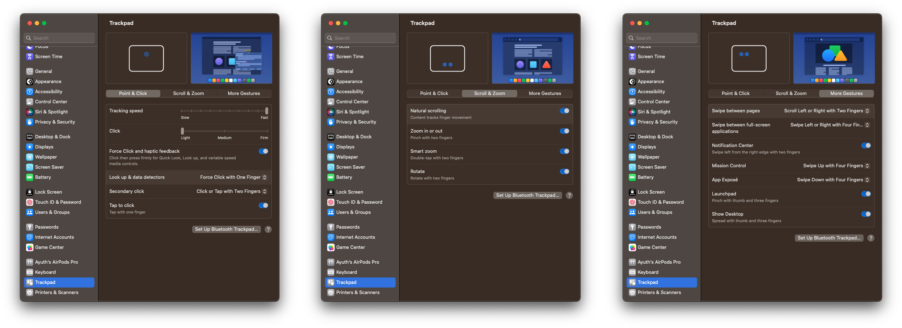
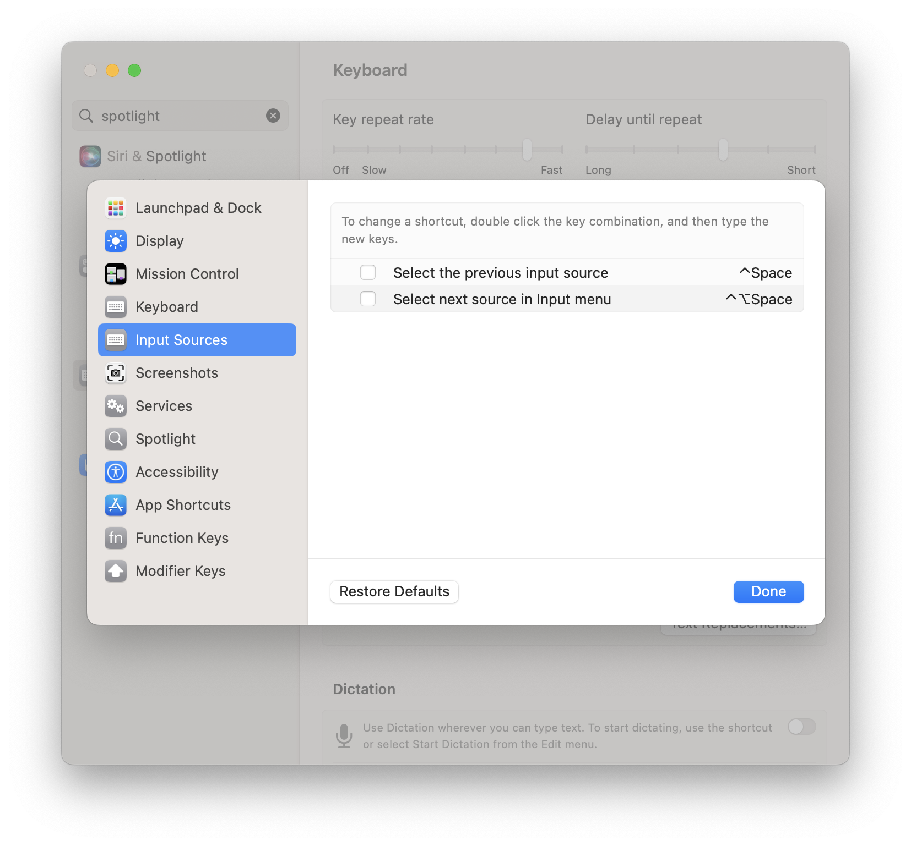
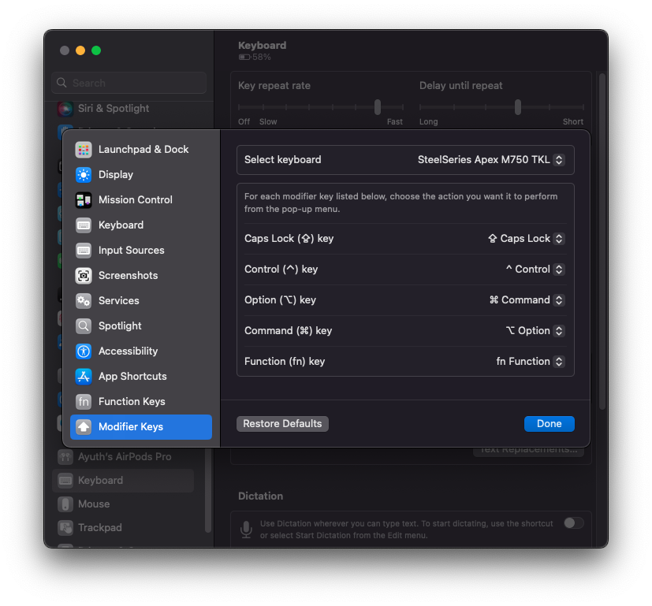
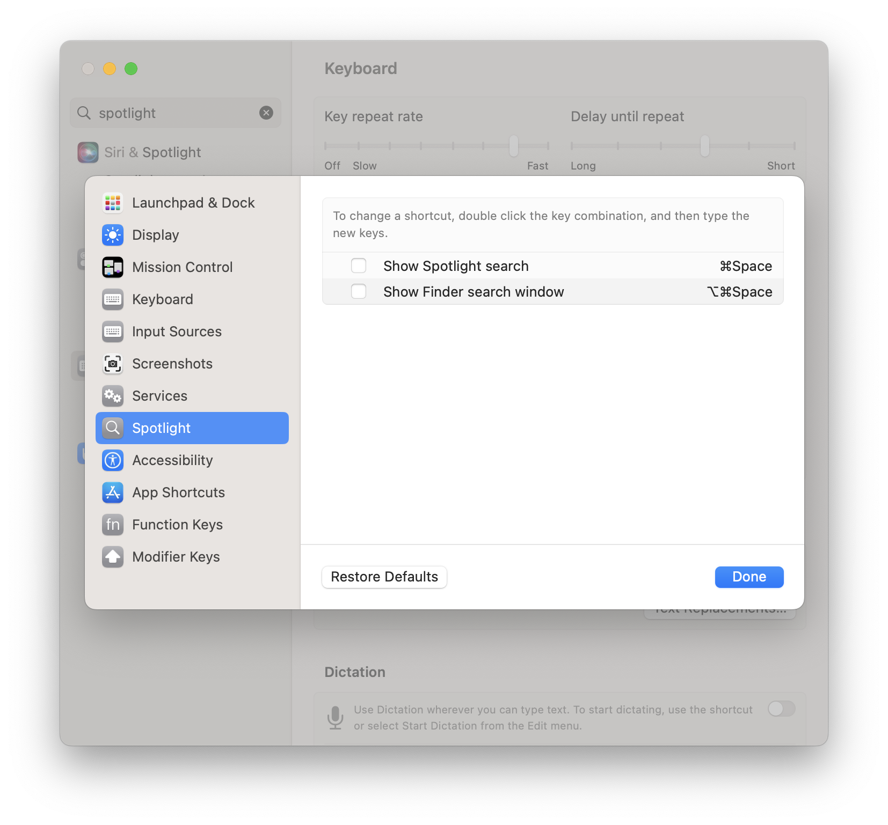

# mac-setup

A walkthrough step-by-step setup of my macOS settings and essential apps.

## macOS specific setup

### Calendar

1. Open System Settings
2. Click the Language and Region Tab
3. Select the calendar in the current opened page.
4. Change from "Buddhist" to "Gregorian".

### Trackpad



#### Enable dragging with three fingers


1. Open System Settings
2. Click the Accessibility tab
3. Click the "Trackpad Options" button
4. Enable the checkbox "Use trackpad for dragging"
   - Dragging style -> Three Finger Drag

### Keyboard 

- Enable key a repeating via:
   ```bash
   defaults write -g ApplePressAndHoldEnabled -bool false
   ```

   the contrast command to disabled it:

   ```bash
   defaults write -g ApplePressAndHoldEnabled -bool true
   ```

   then restart the os.

- Enable: Use scroll gesture with modifier keys to zoom
   1. Open System Settings
   2. Click the Accessibility tab
   3. Click the Zoom menu
   4. Toggle on the "Use scroll gesture with modifier keys to zoom"

#### Change the default input sources



Since we have been using the Caps Lock key for changing the language input.
And the default key binding for input sources is conflicted with the auto-completion for development purposes (e.g., VS Code) hence we need to disable those keys via:

1. Open System Settings
2. Click the Keyboard tab
3. Click the Keyboard Shortcuts... button
4. Click the Input Sources tab
5. Uncheck the following:
   - [ ] Select the previous input source
   - [ ] Select next source in input menu
6. Click Done

#### External keyboard key mapping

Some keyboards natively support Windows not macOS. So we need to re-map the key for use with macOS.



1. Open System Settings
2. Click the Keyboard tab
3. Click the Modifier Keys
4. Change the select option to match your keyboard
5. Change these option
   - Option (⌥) key -> ⌘ Command
   - Command (⌘) key -> ⌥ Option
6. Click Done and test your keyboard

## Essential applications

1. Install [Homebrew](https://brew.sh/).
2. Install these applications:
   - Tap the `homebrew-cask` via:
      - `brew tap homebrew/cask-versions`
   - Install essential apps:
      - `brew install --cask 1password brave-browser raycast`.
   - Install development apps
      - `brew install --cask visual-studio-code`.

### Configurations

#### Dotfiles

1. Install `chezmoi` via:
   ```bash
   $ brew install chezmoi
   ```
2. Point the chezmoi to your dotfiles repository
   ```bash
   $ chezmoi init --apply https://github.com/$GITHUB_USERNAME/dotfiles.git
   ```
3. All dotfiles will be pulled. After that just restart the shell or install the required executables.

#### 1Password

👉 Config Password for [1Password for SSH & Git](https://developer.1password.com/docs/ssh/).

#### Raycast



Replace spotlight search with Raycast via:

1. Open System Settings
2. Click the Keyboard tab
3. Click the Keyboard Shortcuts... button
4. Click the Spotlight tab
5. Uncheck the following:
   - [ ] Show Spotlight search
   - [ ] Show Finder search window
6. Click Done

## Useful snippets

### Install third-party applications

To install third-party apps from outside the AppStore we need to disable Gatekeeper:

```bash
sudo spctl --master-disable
```

re-enabled it:

```bash
sudo spctl --master-enable
```
