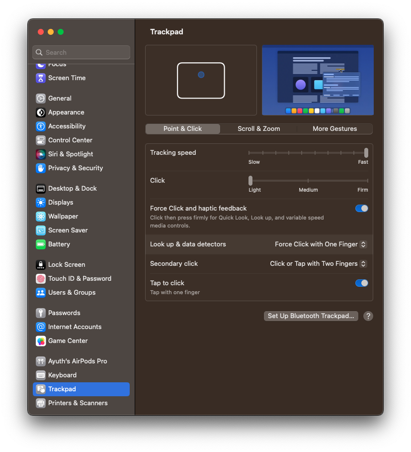
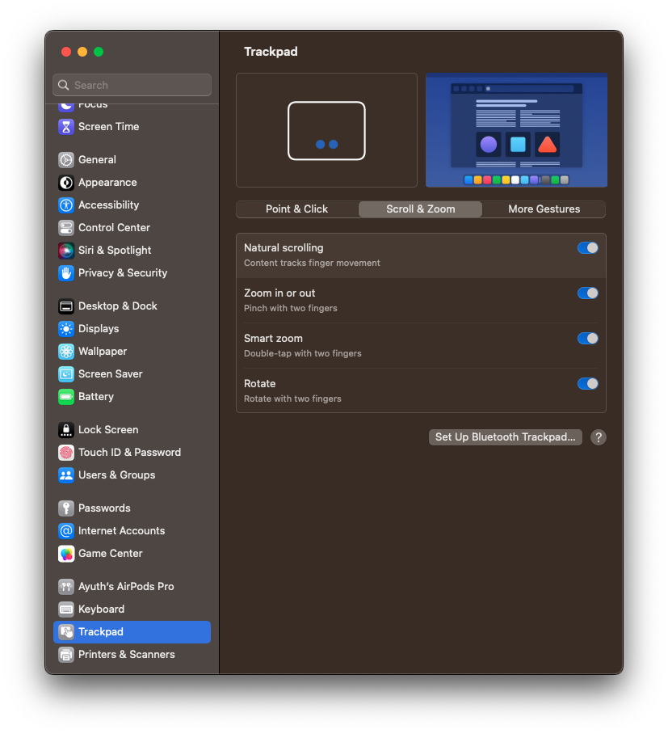
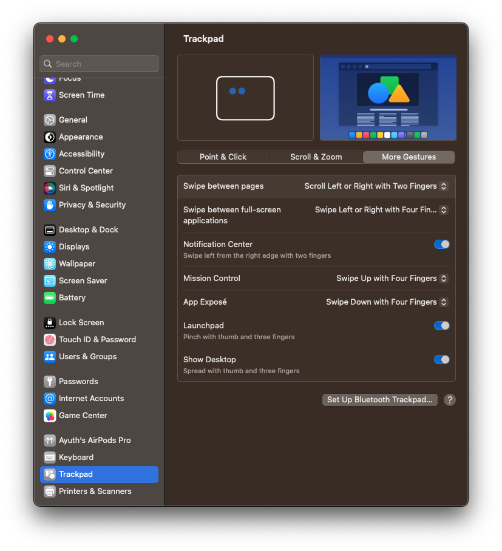
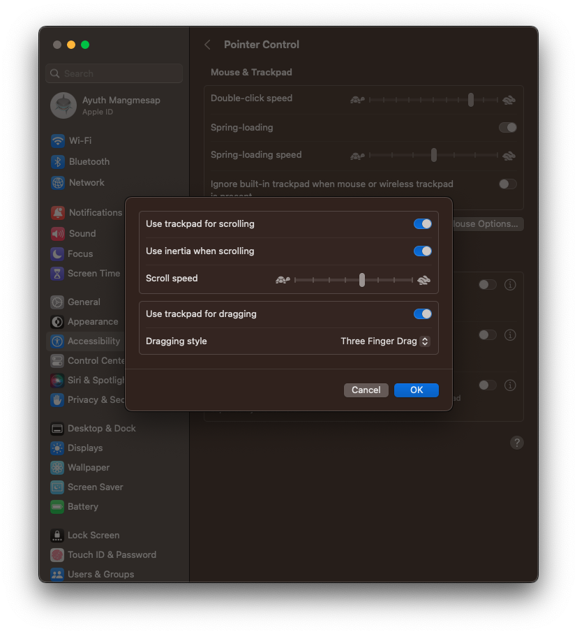

# mac-setup

## Trackpad Setup

### Enable dragging with three fingers

1. Open System Settings
2. Click the Accessibility tab
3. Click the "Trackpad Options" button
4. Enable the checkbox "Use trackpad for dragging
   - Dragging style -> Three Finger Drag
